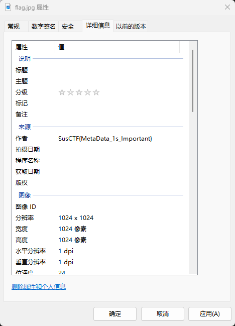

# CTF Writeup: misc1

* **Challenge:** misc1
* **Event:** SusCTF 2017
* **Description:** An introductory challenge focusing on EXIF metadata steganography.
* **Difficulty:** 1 / 10

## Theoretical Background & Methodology

The challenge provides a compressed archive `misc1.zip`. Upon extraction, we obtain a single image file named `flag.jpg`. 

When encountering an image file in a CTF Misc or Steganography challenge, it is best practice to follow a systematic checklist rather than guessing blindly. Common image steganography vectors include:

1. **Multiple File Headers / Appended Data (File Carving):** Files like JPEGs have specific start (`FF D8`) and end (`FF D9`) hex markers. Attackers often append entire files (such as hidden ZIP archives or other images) directly after the end marker. Tools like `binwalk` or `foremost` are routinely used to carve out these hidden embedded files.
2. **Hidden/Altered Dimensions (Width/Height Manipulation):** Sometimes, the image height in the chunk headers (e.g., IHDR chunk for PNGs, SOF markers for JPEGs) is intentionally shrunk. The OS image viewer will only render the modified, smaller height, effectively hiding the visual data at the bottom of the original image. This usually causes CRC checksum errors. We often need to write scripts to brute-force the original width/height to repair the image and reveal the hidden text.
3. **LSB (Least Significant Bit) Steganography:** This technique hides secret data in the lowest bits of the pixel color values (RGB channels). Because it modifies the least significant bit, the color variation is practically invisible to the naked human eye. Tools like `zsteg` or Stegsolve are standard for detecting and extracting LSB payloads.
4. **EXIF Metadata Steganography:** Exchangeable Image File Format (EXIF) data normally stores benign information such as camera settings, GPS coordinates, and copyright details. However, CTF creators frequently inject flags or hints directly into these metadata fields.

## Resolution Steps

Following the methodology outlined above, we should always start with the simplest and most accessible checks before moving to complex hex analysis or LSB extraction.

1. **Initial Inspection:** Extracted the provided `misc1.zip` to find the `flag.jpg` image.
2. **EXIF Metadata Check:** Since checking metadata is the quickest step, we inspect the file properties. 
3. Operating on a Windows system, we can easily check this without third-party tools like `exiftool`. I simply right-clicked the `flag.jpg` file, selected **Properties**, and navigated to the **Details** tab.

   

4. **Flag Discovery:** Upon inspecting the detailed properties, the flag was plainly visible in the **Author** field. The challenge is solved directly without further complex analysis.

## Flag

`[Replace with the actual flag you found, e.g., SusCTF{xxxxxx}]`
