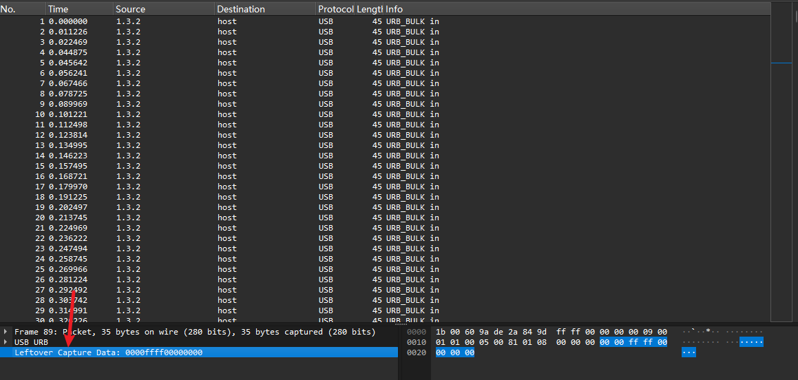
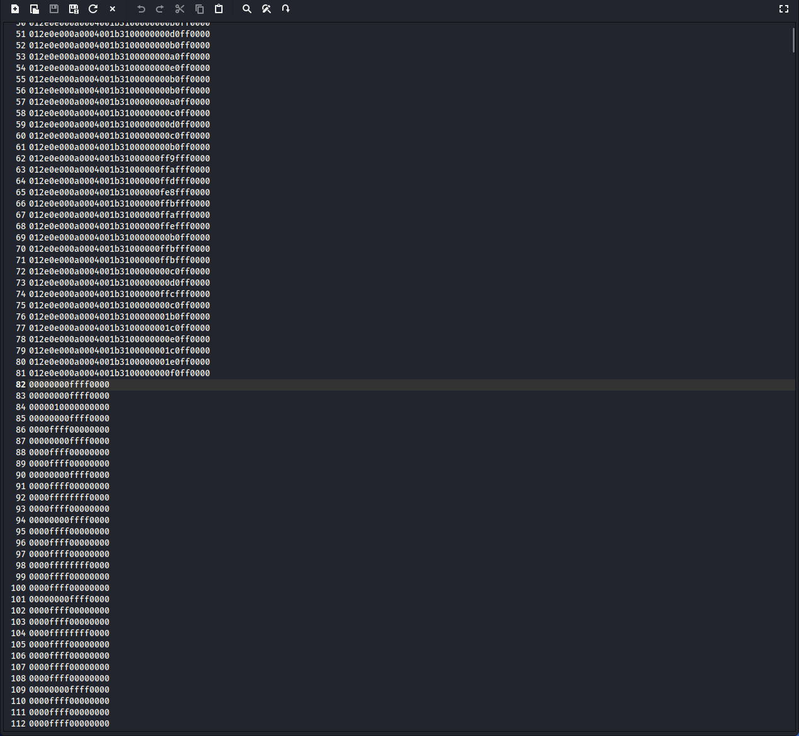
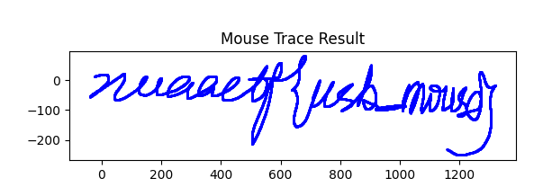

# CTF Writeup: Traffic

  * **Title**: traffic
  * **Source**: NUAACTF 2017
  * **Category**: Traffic Analysis
  * **Difficulty**: 4 (on a scale of 1-10)

## Challenge Overview & Initial Analysis

Initially, extracting the provided archive reveals a `1.pcap` file. A PCAP file is a common format utilized to store network packet captures, containing an exact byte-for-byte copy of every packet seen on the network, spanning OSI layers 2 through 7. Recognizing this file format immediately indicates that the core objective of this challenge is traffic analysis.

### Deep Dive: What is a PCAP?

*In Capture The Flag (CTF) security competitions, traffic analysis challenges frequently provide a PCAP (Packet Capture) or PCAPNG file. These files are typically generated by network sniffing tools like Wireshark or tcpdump. The goal is to act as a forensic investigator, analyzing the recorded data streams—which could be unencrypted HTTP requests, malicious file downloads, or even hardware-level USB communications—to extract a hidden "flag".*

By analyzing the protocol hierarchy within this file, it becomes clear that this is specifically a USB traffic challenge. We can use the command-line tool `tshark` to extract the "Leftover capture data".

 

We execute the following `tshark` command to extract the payload:
`tshark -r 1.pcap -T fields -e usb.capdata > usb_data.txt` 

### Deep Dive: Utilizing Tshark

*`tshark` is the terminal-based counterpart to the Wireshark network analyzer. Let's break down the flags used in this command:*

  * *`-r 1.pcap`: Reads the specific packet capture file.*
  * *`-T fields`: Instructs the tool to output specific packet fields rather than a generalized summary.*
  * *`-e usb.capdata`: Targets the raw payload data of the USB packets (essentially, the remaining raw data after the standard USB protocol headers are stripped away).*
  * *`> usb_data.txt`: Redirects this extracted raw data into a text file for scripting and processing.*

Executing this generates the following output file: 

 

Because the vast majority of the lines in this file have a length of 8 bytes, we can deduce that this represents mouse traffic.

-----

## Technical Explanation: The USB Mouse Protocol

In the USB protocol, the format of the data sent by a mouse is not rigidly fixed. When a mouse connects to a computer, it sends a "Report Descriptor" to instruct the host computer on the exact format it will use to transmit its data.
Mouse traffic typically appears as either 4 bytes or 8 bytes of data per packet. For example, a data payload might look like `0100ff00`, or as seen on line 82 of the provided image, `00000000ffff0000`.

### The Four-Byte Format

When a mouse uses a 4-byte transmission format, the data is mapped as follows: 

  * **Byte 1**: Represents the button state (`01` for Left click, `02` for Right click, `00` for No click, `03` for Left and Right clicked simultaneously).
  * **Byte 2**: Represents the X-axis offset, indicating horizontal movement encoded in two's complement hexadecimal (e.g., `ff` means the mouse moved to the left by 1 unit).
  * **Byte 3**: Represents the Y-axis offset, indicating vertical movement.
  * **Byte 4**: Represents the scroll wheel state.

### The Eight-Byte Format (Standard)

In a standard 8-byte mouse scenario, the mapping is expanded: 

  * **Byte 0 (Characters [0:2])**: Button state, where `00` means no button pressed, `01` means left button pressed, `02` means right button pressed, and `03` means both buttons are pressed simultaneously.
  * **Byte 1 (Characters [2:4])**: Placeholder or reserved bit, usually fixed at `00`.
  * **Byte 2 (Characters [4:6])**: X-axis offset for horizontal movement, representing relative distance as a signed 8-bit integer using two's complement. Values `01` to `7f` represent movement to the right (positive), while `80` to `ff` represent movement to the left (negative, e.g., `ff` equals -1).
  * **Byte 3 (Characters [6:8])**: Y-axis offset for vertical movement, also formatted as a signed 8-bit integer. Positive numbers typically indicate downward movement, while negative numbers (like `ff`) indicate upward movement.
  * **Byte 4 (Characters)**: Scroll wheel state, representing the value of the wheel being scrolled up or down.
  * **Byte 5 ~ Byte 7 (Characters)**: Extra functional bits or pure placeholders, usually entirely `00`.

### The Eight-Byte Format (High-Precision Mouse)

For high-precision mice (which this challenge uses), the 8-byte structure handles coordinates differently to allow for finer tracking: 

  * **Byte 0 (Characters [0:2])**: Button state, where `00` means no click, and `01` means left click is pressed.
  * **Byte 1 (Characters [2:4])**: Placeholder, always `00`.
  * **Byte 2 ~ Byte 3 (Characters [4:8])**: X-axis offset represented as a little-endian 16-bit integer. For example, `0100` found on line 84 is evaluated as `0001` in memory, meaning the X-axis moved right by 1 unit. Conversely, `ffff` on line 86 is a signed 16-bit hexadecimal integer representing the X-axis moving left by 1 unit (i.e., -1).
  * **Byte 4 ~ Byte 5 (Characters)**: Y-axis offset, also represented as a little-endian 16-bit integer. For example, `ffff` on line 82 indicates that the Y-axis moved by -1.
  * **Byte 6 ~ Byte 7 (Characters)**: Scroll wheel and placeholder, always `0000`.

### Deep Dive: Endianness and Two's Complement

  * **Little-Endian Architecture**: In computer science, "little-endian" means the least significant byte of a multi-byte data type is stored first (at the lowest memory address). This is why the hexadecimal sequence `01 00` translates to the decimal integer `1`, rather than `256`. 
  
  * **Two's Complement Representation**: This is the standard mathematical method computers use to represent signed integers (allowing for negative numbers). To represent `-1` as a 16-bit binary number, a computer takes the positive number `1` (`0000 0000 0000 0001`), inverts every bit to get `1111 1111 1111 1110`, and then adds `1` to get `1111 1111 1111 1111`. In hexadecimal formatting, this is written as `ffff`.
  

-----

## Scripting and Flag Extraction

This specific CTF challenge is designed to test your ability to analyze high-precision mouse traffic. After understanding the underlying principles of how high-precision mice transmit movement data, we can write a Python script to parse these byte sequences and render the mouse's actual movement trajectory on a canvas. While online plotting tools exist, writing a custom script is an excellent way to practice core scripting capabilities.
We begin by drafting the following file: `Visualize_USB_Data.py`.

`./Visualize_USB_Data.py` 

By executing the script, simulating the clicks, and plotting the running totals of the X and Y coordinates, the hidden path drawn by the original user's mouse becomes clearly visible, allowing us to capture the final flag.

