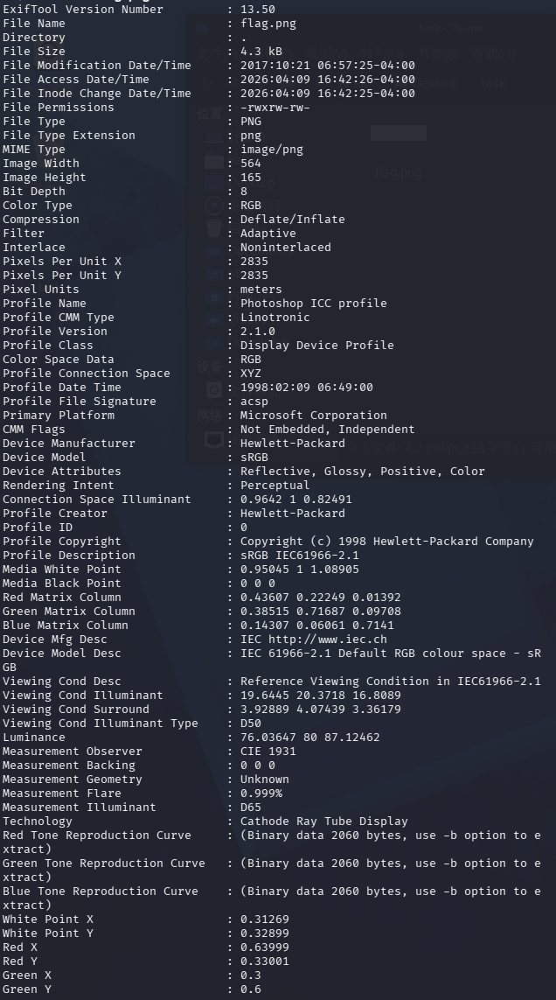
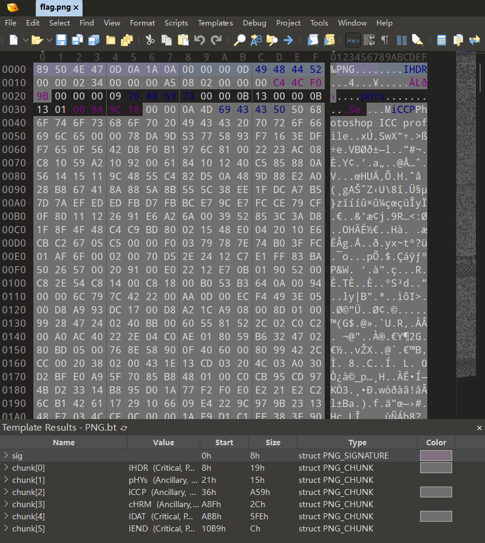
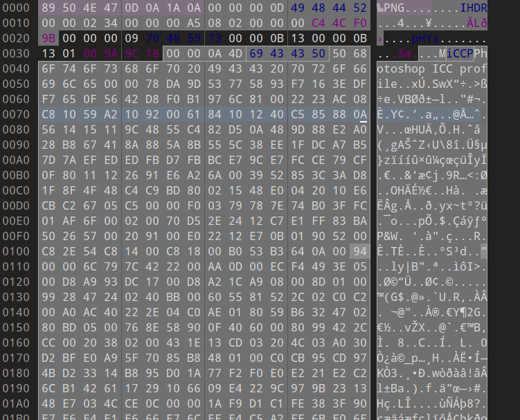
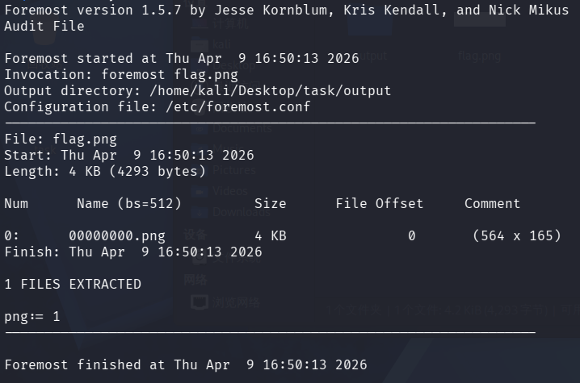
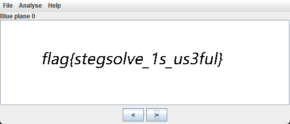

# CTF Writeup: traffic

\* **Challenge:** An image containing information
\* **Event:** Xp0intCTF 2017
\* **Category:** Image Steganography
\* **Difficulty:** 3 (1-10)

## Vulnerability Analysis & Approach

The approach to image steganography challenges is generally quite straightforward and follows a standard workflow. This challenge is analyzed step-by-step by referring to this methodology. The core sequence of the investigation is as follows:

1.   Check file properties (Metadata/Exif).
2.   Examine raw source code characters (Strings).
3.   Analyze file headers and look for structural appending.
4.   Evaluate color layers and pixel features.
5.   Guess encryption tool suites.

-----

## Resolution Steps

### 1\. Basic Information Gathering

First, we check for the presence of Exif information using the built-in properties function in Windows, but none is found. To prevent missing any hidden data, we transfer the image file to Kali Linux and use `exiftool` for a more thorough analysis.

> **Technical Detail on Exif Data:** Exif (Exchangeable Image File Format) data stores metadata such as camera settings, timestamps, software used, and GPS coordinates. CTF authors frequently inject flags directly into these text-based metadata fields.

The analysis results indicate that there is no Exif steganography. Next, we attempt to check if there are any printable characters hidden within the file's binary by opening it in the 010 Editor.

> **Technical Detail on String Extraction:** Opening a file in a Hex Editor allows us to view the raw hexadecimal bytes and their ASCII equivalents. We are looking for hardcoded "plaintext" strings that might resemble a flag format (e.g., `flag{...}`). Tools like the Linux `strings` command are also commonly used for this step.

After reviewing the hex dump, no suspicious printable characters are discovered.

### 2\. File Structure and Appended Content Analysis

Moving on to structural analysis, we verify that there are no problems with the file header.

> **Technical Detail on Magic Bytes:** Every file format has a specific "Magic Byte" signature at its very beginning. For a PNG file, the hexadecimal header should always be `89 50 4E 47 0D 0A 1A 0A`. Verifying this ensures the file hasn't been maliciously corrupted or disguised with a fake extension.

We then use the `foremost` tool to analyze if there are any files appended to the image, and we find that only one PNG file exists.

> **Technical Detail on File Carving:** `foremost` (or `binwalk`) is a file carving tool that scans the binary sequence for known headers and footers of various file types (like ZIP, RAR, or other images). If an author used a command like `copy /b img.png + hidden.zip output.png` to append an archive to the image (a technique known as "image seeding"), `foremost` would detect the appended file signature and extract it automatically.

Up to this point, the file structure and appended content analysis have not revealed any hidden flags, so we must consider visual and pixel analysis.

### 3\. Visual and Pixel Analysis

We use the Stegsolve tool to separate the color channels and try examining the different channels. Ultimately, we discover the hidden flag within Blue Plane 0.

> **Technical Detail on LSB Steganography:** Digital images are typically composed of Red, Green, and Blue (RGB) color channels. Each channel is represented by 8 bits of data. "Plane 0" refers to the Least Significant Bit (LSB) of that color channel. LSB steganography involves replacing this lowest-value bit with binary secret data. Because changing the 1st bit only alters the pixel's color value imperceptibly (e.g., RGB `255, 255, 255` becomes `255, 255, 254`), the human eye cannot see the difference. However, tools like Stegsolve can extract and visualize exclusively these specific bit planes to reveal hidden texts, shapes, or QR codes.

-----

## Conclusion

The difficulty of this challenge is not particularly high. It primarily tests the standard problem-solving methodology for image steganography challenges, ultimately leading to the concept of color channel separation.
