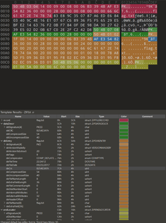

# CTF Writeup: Crack Zip

* [cite_start]**Challenge:** Crack Zip [cite: 1]
* [cite_start]**Event:** SusCTF 2017 [cite: 2]
* [cite_start]**Description:** This challenge involves bypassing or cracking an encrypted ZIP archive[cite: 3].

## Vulnerability Analysis & Approach

[cite_start]Before blindly attempting to crack the password, it is essential to understand the common techniques used in archive-based CTF challenges[cite: 4]. 

[cite_start]Since the target is a ZIP file, our first step should be to check for **pseudo-encryption** (fake encryption)[cite: 5]. [cite_start]If the archive is genuinely encrypted, we must then evaluate the feasibility of a brute-force attack[cite: 5]. [cite_start]Because we do not have any known plaintext files or specific hints regarding the password's structure, Known Plaintext Attacks (KPA) and Mask Attacks are not viable options[cite: 5].

## Resolution Steps

1. **Initial Inspection:** Attempted to extract the archive using Bandizip. [cite_start]A password prompt appeared, and the archive's directory revealed a single target file named `flag.txt`[cite: 6].
2. [cite_start]**Hex Analysis:** Opened the ZIP file in a hex editor (010 Editor) to inspect its underlying file structure and metadata[cite: 7].
   
   

3. **Pseudo-Encryption Check:** Analyzed the general-purpose bit flags. [cite_start]Both the local file header flag (`frflag`) and the central directory file header flag (`deflag`) are odd numbers[cite: 8]. [cite_start]This confirms that the file is genuinely encrypted, successfully ruling out the pseudo-encryption trick[cite: 8].
4. **Brute-Force Attack:** Loaded the archive into ARCHPR (Advanced Archive Password Recovery). [cite_start]Configured the brute-force parameters to scan a purely numeric range from `0` to `99999999`[cite: 9].
5. [cite_start]**Password Recovery:** The brute-force process successfully recovered the archive password: `20170925`[cite: 10].
6. [cite_start]**Flag Extraction:** Used the recovered password to extract `flag.txt` and retrieve the flag[cite: 11].

## Flag

[cite_start]`Susctf{ec1717de879b19792c77f5edacbb84dc}` [cite: 12]