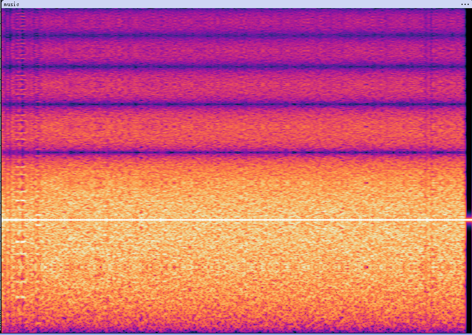
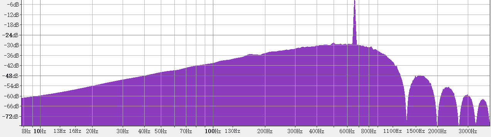
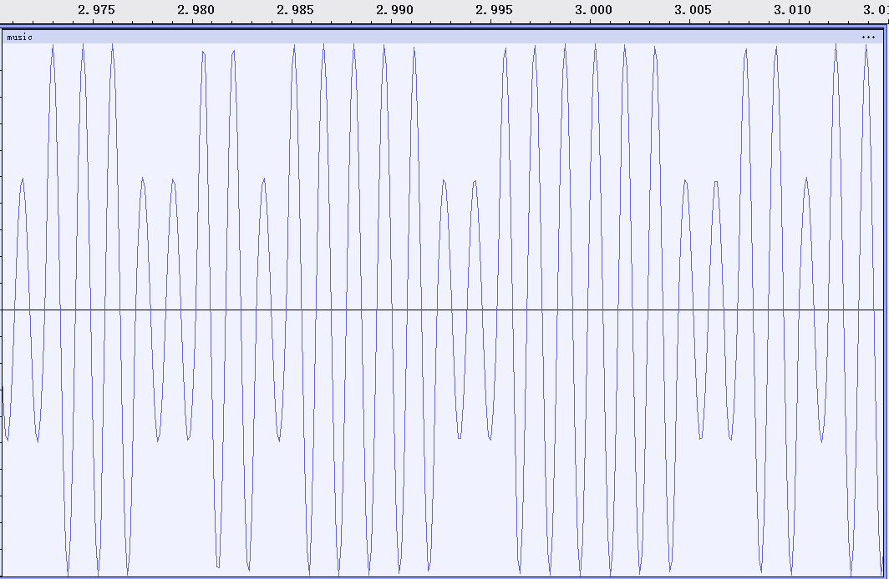
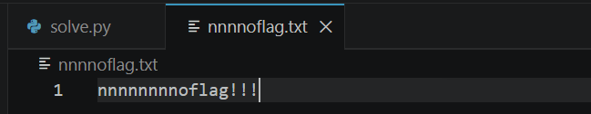
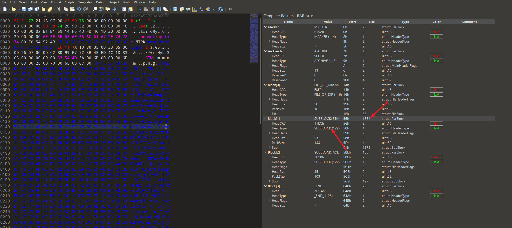
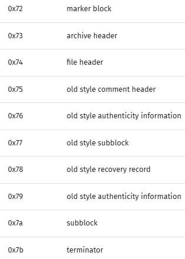
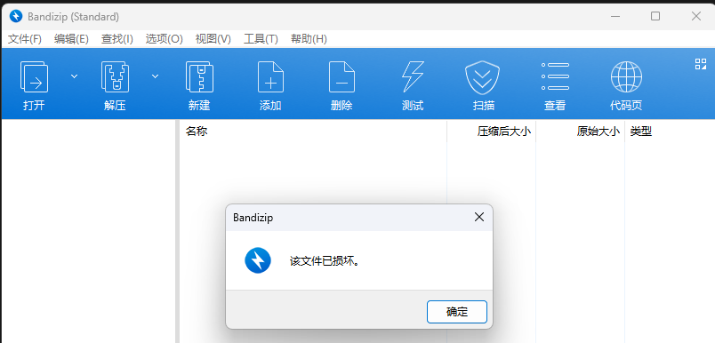
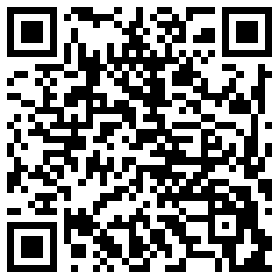
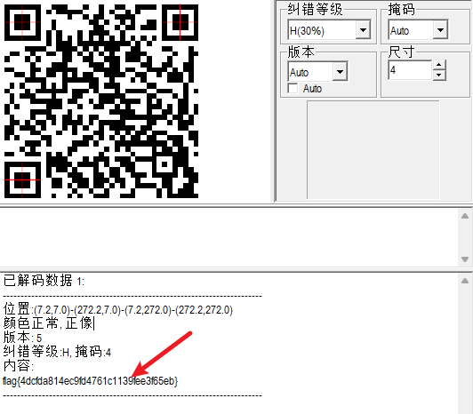

# CTF Challenge Write-up: 3-Unpleasant\_music

  * **Challenge Title:** 3-Unpleasant\_music
  * **Source:** Wangding Cup 2018
  * **Category:** Audio Steganography
  * **Difficulty:** 9 / 10
  * **Author:** DanielZou77

## Initial Analysis & Routine Checks

The challenge provides a compressed archive containing an audio file named `music.wav`, strongly suggesting an audio steganography challenge.

First, we conducted routine checks (Exif steganography, checking for plaintext in metadata, and inspecting for file concatenation). We found no exploitable information, confirming that we need to treat this strictly as an audio analysis problem.

## Auditory & Spectral Investigation

The first step in audio steganography is to listen carefully for abnormal sounds. We listen for:

  * Obvious "ticks" (Morse code)
  * Dial tones (DTMF - Dual-tone multi-frequency signaling)
  * Harsh, chaotic fax-like noises (SSTV - Slow-Scan Television)
  * Unnatural segments (potentially reversed or speed-altered audio)

We ruled out SSTV and DTMF. Because no obvious steganographic method could be heard, the audio essentially sounded like static noise. Next, we analyzed the spectrogram using Audacity.



The initial spectrogram didn't reveal any obvious visual clues. However, after attempting frequency analysis, I noticed a distinct pattern in the audio's frequencies, leading me to suspect **Echo Hiding**.



> **Tech Deep Dive: Echo Hiding**
> Echo hiding is a form of audio steganography where data is embedded into an audio signal by introducing extremely tiny, imperceptible delays (echoes). For instance, a delay of 1 millisecond might represent the binary digit `0`, while a 2-millisecond delay represents `1`.
>
> When the original signal and its slightly delayed counterpart are superimposed, they create constructive and destructive interference at specific frequencies. When viewed on a frequency spectrum, this interference manifests as periodic peaks and valleys (often called a "cepstrum" effect).

Despite the suspicion, standard Echo Hiding extraction methods failed to solve the challenge. Subsequent attempts to extract potential SSTV images also yielded nothing.

## Waveform Analysis & ASK Modulation

Changing tactics, I zoomed heavily into the waveform and discovered a distinct pattern that closely resembled a binary `01` sequence.



> **Tech Deep Dive: Amplitude Shift Keying (ASK)**
> The "01 sequence" extracted here tests a classic concept in digital communications: signal modulation and demodulation, specifically ASK.
>
> ASK is a form of amplitude modulation where digital data is represented by variations in the amplitude (the height or power) of a carrier wave. In a simple binary ASK system (often called On-Off Keying), a binary `1` is represented by transmitting a high-amplitude wave, and a `0` is represented by a low-amplitude (or zero-amplitude) wave. By visually inspecting or programmatically analyzing the high and low peaks in this waveform, we can decode the underlying binary stream.

We then processed this audio file using a custom Python script (this is the most challenging part of the problem):

```python
import wave, codecs
import numpy as np

# Part 1: Read audio data and convert to a numerical array
# Open the audio file in the same directory in read-only binary mode ("rb")
wavfile = wave.open(u'music.wav', "rb")

# getparams() returns a tuple containing audio parameters: (nchannels, sampwidth, framerate, nframes, ...)
params = wavfile.getparams() 
nframes = params[3] # Extract the 4th value from the tuple, which is the total number of audio frames (samples)

# Read all audio frame data; at this point, datawav is an extremely long raw byte stream (bytes/string format)
datawav = wavfile.readframes(nframes) 
wavfile.close() # Good practice: immediately close the file stream after reading

# Key point: Convert the raw byte stream into a numpy array of 16-bit short integers (np.short).
# This turns the audio waveform into positive and negative numbers with a maximum value of around 32767.
datause = np.frombuffer(datawav, dtype = np.short)

# Part 2: Core parsing logic (Zero-crossing detection and amplitude extraction)
result_bin = '' # Used to concatenate the extracted binary string ('0101...')
result_hex = '' # Used to concatenate the converted hexadecimal string ('5261...')

# mx is used to record the maximum amplitude (highest peak) within the "current complete wave (cycle)"
mx = 0 

# Iterate through each sample point (subtract 1 to prevent datause[i+1] array out-of-bounds errors later)
for i in range(len(datause) - 1):
    
    # 1. Continuously track the maximum value within the current cycle
    if datause[i] > mx:
        mx = datause[i]
        
    try:
        # 2. Zero-crossing detection: Determine if it crosses the X-axis into the next cycle
        # If the current point is below the X-axis (negative), and the immediate next point is above the X-axis or exactly 0
        # This means the old wave has ended, and a new wave has begun!
        if (datause[i] < 0 and datause[i+1] >= 0):
            
            # 3. Settle the data extracted from the previous cycle
            # 24000 is the set threshold (about 73% of the maximum amplitude 32767)
            if (mx - 24000 > 0): 
                result_bin += '1' # Peak > threshold, judged as high amplitude, record '1'
            else:
                result_bin += '0' # Peak < threshold, judged as low amplitude, record '0'
                
            # 4. After settling, reset mx to the starting point of the new cycle, ready for the next round of recording
            mx = datause[i+1] 
    except:
        break

# Part 3: Data format conversion and file export
# Convert the extracted long binary string into hexadecimal, in groups of 4 bits.
# int(xxx, 2) converts binary to decimal, hex() converts to hexadecimal.
# [2:] is to remove the '0x' prefix automatically generated by Python when creating a hexadecimal string.
for i in range(0, len(result_bin), 4):
    result_hex += hex(int(result_bin[i : i + 4], 2))[2:]

# CTF Tip: A hexadecimal string starting with '52617221' indicates a RAR archive
# Create a new file named result.rar in write binary mode ("wb")
file_rar = open("result.rar", "wb")

# codecs.decode(..., 'hex_codec') restores plain text like '526172' back into real binary machine code
file_rar.write(codecs.decode(result_hex, 'hex_codec'))

file_rar.close() # Writing complete, save and close
```

## RAR Archive Manipulation

Processing the audio yielded a `.rar` compressed file. Extracting it gave us a text file named `nnnnoflag.txt`. Opening it revealed no flag.



Suspecting that the archive itself contained hidden data, we shifted our focus to archive steganography. After checking for appended files and Exif data without success, we analyzed the `.rar` file using 010 Editor.



After extensive analysis, we noticed an anomaly regarding `block[1]`. It was identified as a `subblock` type, but its volume was far too large for a standard subblock, indicating a hidden file was nested inside. We located the `HeadType` byte. The following image shows the different HEX values corresponding to different header types:



> **Tech Deep Dive: RAR Block Structures & Header Types**
> A RAR archive is constructed from a sequence of data blocks (headers), such as the Main Archive Header, File Headers, and Terminator Blocks. Each block begins with a `HEAD_TYPE` byte that defines its purpose. For example, `0x74` denotes a File or Directory block.
>
> In CTF challenges, an author might manually change a File Header (`0x74`) to a different type, like a Comment or Subblock. Standard extraction tools will read this altered header, assume the block doesn't contain a file, and skip it entirely, effectively hiding the data. By changing the byte back to `0x74`, we force the extractor to recognize the hidden file.

We changed the `HeadType` byte to `0x74` (`FILE_OR_DIR`). However, we ran into an issue: because of CRC (Cyclic Redundancy Check) validation mechanisms, Bandizip failed to correctly extract the hidden file, reporting it as corrupted.



To bypass this, I used WinRAR. While it still warned about a corrupted file header, WinRAR can bypass the CRC check and force the extraction. This successfully yielded a file named `STM`.

## Image Restoration & PNG Brute-forcing

Using the Linux `file` command, we determined that `STM` was actually a PNG image. After changing the file extension, we opened it to find a QR code that was cut in half.


This immediately pointed to a classic CTF technique: PNG width/height brute-forcing.

> **Tech Deep Dive: PNG Width/Height Brute-forcing**
> In steganography, authors often maliciously decrease the height or width of a PNG image in a hex editor. The goal is to hide critical information (like a flag or the bottom half of a QR code) in the "cropped" out area.
>
> Because the default image viewers on Windows and Mac often lack strict structural validation, they simply render the image using the newly modified dimensions, hiding the rest of the data from view.
>
> The core breakthrough relies on the **IHDR (Image Header) chunk**. This chunk stores the image dimensions and is followed by a **CRC32 checksum** calculated based on that exact data. When the author modifies the height/width, the new data no longer matches the original CRC32 checksum stored in the file. By writing a script to enumerate (brute-force) all possible width and height combinations and recalculating the CRC32 until it matches the original checksum, we can discover the true dimensions and restore the full image.

Knowing the theory, we can automate this process. I utilized the [Deformed-Image-Restorer](https://github.com/AabyssZG/Deformed-Image-Restorer) tool created by AabyssZG.

The tool successfully brute-forced the dimensions and restored the complete QR code:



Finally, scanning the complete QR code with a scanning tool revealed the flag\!


